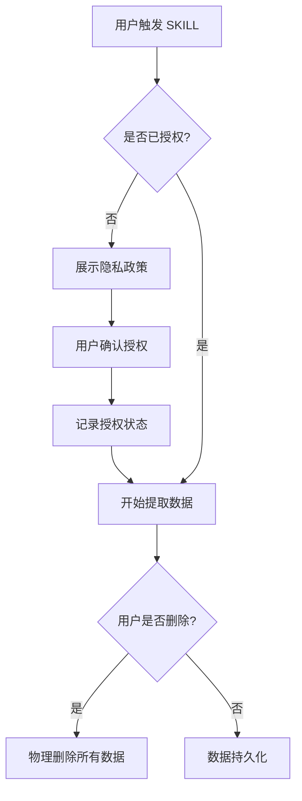

# 数据安全保护方案

> **目标：确保用户微信数据在 SKILL 处理过程中的安全性和隐私保护**

---

## 📋 安全威胁分析

### 威胁 1：数据泄露

**威胁描述：**
- 导出的聊天记录文件可能被未授权访问
- 数据库密钥可能泄露
- 提取的联系人信息可能被滥用

**风险等级：** 🔴 高

### 威胁 2：数据上传

**威胁描述：**
- PyWxDump 是否偷偷上传数据到第三方服务器
- SKILL 是否上传数据到云端 API
- 训练数据是否被公开

**风险等级：** 🟠 中（经验证：PyWxDump 无上传，但需文档说明）

### 威胁 3：数据加密缺失

**威胁描述：**
- 导出的 CSV/HTML 文件未加密
- 数据库密钥未加密存储
- 临时文件未清理

**风险等级：** 🟠 中

### 威胁 4：微信协议违规

**威胁描述：**
- 使用 PyWxDump 可能违反微信用户协议
- 导出聊天记录可能违反隐私法
- 数字人模拟可能侵犯人格权

**风险等级：** 🟠 中

---

## 🛡️ 安全保护措施

### 措施 1：数据本地化处理

**原则：** 所有数据在本地处理，绝不上传到任何服务器。

**具体措施：**
- ✅ PyWxDump 已验证：纯本地工具，无上传功能
- ✅ SKILL 本地运行：不调用云端 API
- ✅ 数字人训练：使用本地模型或用户提供的 API Key
- ✅ 日志记录：仅在本地记录，不上传

**验证方法：**
```bash
# 检查网络连接
netstat -an | grep <PyWxDump进程>

# 检查日志文件
grep "upload" logs/*.log
grep "post" logs/*.log
```

### 措施 2：数据加密存储

**原则：** 敏感数据必须加密存储。

**具体措施：**

| 数据类型 | 存储位置 | 加密方式 | 密钥管理 |
|---------|---------|---------|---------|
| **聊天记录 CSV** | `manual_input/extracted/` | AES-256-GCM | 用户提供的密钥 |
| **数据库密钥** | 临时内存 | 内存加密 | 运行时生成，不持久化 |
| **联系人信息** | `skill_config.json` | 可选加密 | 环境变量或用户密钥 |
| **数字人模型** | `models/` | 可选加密 | 模型文件加密 |

**实现方案：**

```python
# 1. 加密聊天记录文件
from cryptography.fernet import Fernet

def encrypt_file(input_path, output_path, key):
    """
    加密文件
    :param input_path: 输入文件路径
    :param output_path: 输出文件路径
    :param key: 加密密钥（32字节）
    """
    fernet = Fernet(key)
    with open(input_path, 'rb') as f:
        data = f.read()
    encrypted = fernet.encrypt(data)
    with open(output_path, 'wb') as f:
        f.write(encrypted)

# 2. 使用环境变量管理密钥
import os

def get_encryption_key():
    """
    从环境变量获取加密密钥
    :return: 加密密钥（32字节）
    """
    key = os.getenv('ENCRYPTION_KEY')
    if not key:
        raise ValueError("请设置环境变量 ENCRYPTION_KEY")
    return key.encode()
```

### 措施 3：临时文件清理

**原则：** 临时文件必须及时清理，避免残留。

**具体措施：**
- ✅ 提取完成后自动清理临时数据库文件
- ✅ 解密后的明文文件使用后立即删除
- ✅ 日志文件定期清理（保留 7 天）
- ✅ 提供"清理所有数据"功能

**实现方案：**

```python
import shutil
import tempfile
from pathlib import Path

def cleanup_temp_files(temp_dir):
    """
    清理临时文件
    :param temp_dir: 临时目录
    """
    if os.path.exists(temp_dir):
        shutil.rmtree(temp_dir)
        print(f"✅ 已清理临时目录: {temp_dir}")

def cleanup_old_logs(log_dir, days=7):
    """
    清理旧日志文件
    :param log_dir: 日志目录
    :param days: 保留天数
    """
    cutoff_time = time.time() - (days * 24 * 60 * 60)
    for log_file in Path(log_dir).glob('*.log'):
        if log_file.stat().st_mtime < cutoff_time:
            os.remove(log_file)
            print(f"✅ 已删除旧日志: {log_file}")
```

### 措施 4：访问权限控制

**原则：** 只有授权用户才能访问敏感数据。

**具体措施：**

| 文件/目录 | 访问权限 | 说明 |
|-----------|---------|------|
| **chat_logs/** | 仅用户可读写 | 聊天记录存储 |
| **extracted/** | 仅用户可读写 | 提取的原始数据 |
| **models/** | 仅用户可读 | 数字人模型文件 |
| **logs/** | 仅用户可读写 | 日志文件 |

**实现方案：**

```python
import stat

def set_secure_permissions(file_path):
    """
    设置安全权限
    :param file_path: 文件路径
    """
    # Windows: 隐藏文件
    if os.name == 'nt':
        os.system(f'attrib +h "{file_path}"')
    
    # Unix-like: 仅用户可读写
    else:
        os.chmod(file_path, stat.S_IRUSR | stat.S_IWUSR)
```

### 措施 5：用户授权和隐私保护

**原则：** 严格遵守用户授权，保护隐私。

**具体措施：**
- ✅ **授权记录**：`consent_record.json` 记录用户授权状态
- ✅ **删除即物理删除**：用户删除数据时，彻底清除文件
- ✅ **数据最小化**：只提取必要的数据，不过度收集
- ✅ **隐私声明**：在使用前展示隐私政策

**授权流程：**



**隐私声明示例：**

```markdown
## 隐私声明

### 数据收集
- 收集范围：仅收集您授权的微信聊天记录
- 收集目的：用于生成逝者数字人，供亲友缅怀
- 收集方式：本地提取，不上传到任何服务器

### 数据处理
- 处理方式：纯本地处理，使用 PyWxDump 和 memorial-skill-builder
- 数据加密：所有敏感数据加密存储
- 数据保留：直到您主动删除

### 数据删除
- 删除方式：物理删除，不可恢复
- 删除范围：所有聊天记录、联系人信息、数字人模型
- 删除后：SKILL 将无法再访问该数据

### 法律合规
- 本工具仅供个人缅怀使用
- 请遵守微信用户协议
- 请遵守当地隐私法律法规
```

---

## 🔒 安全检查清单

### 使用前检查

- [ ] 用户已阅读并同意隐私声明
- [ ] 用户已设置加密密钥（环境变量 `ENCRYPTION_KEY`）
- [ ] 微信电脑版已登录
- [ ] 已确认微信数据路径正确
- [ ] 用户已了解删除即物理删除的后果

### 提取过程中检查

- [ ] 数据库密钥提取成功
- [ ] 聊天记录提取成功
- [ ] 数据已加密存储
- [ ] 临时文件已清理
- [ ] 日志记录完整

### 提取完成后检查

- [ ] 数据文件权限设置正确
- [ ] 加密文件可正常解密
- [ ] 数字人模型生成成功
- [ ] 无未清理的临时文件
- [ ] 用户已获取数据访问权限

---

## 🚨 应急响应方案

### 泄露事件处理

**场景 1：聊天记录文件泄露**

```python
def handle_data_leak(leak_path):
    """
    处理数据泄露事件
    :param leak_path: 泄露的文件路径
    """
    print("🚨 检测到数据泄露事件！")
    
    # 1. 立即删除泄露文件
    if os.path.exists(leak_path):
        os.remove(leak_path)
        print(f"✅ 已删除泄露文件: {leak_path}")
    
    # 2. 通知用户
    print("⚠️ 请立即检查您的加密密钥是否泄露")
    print("⚠️ 建议更换加密密钥并重新加密所有数据")
    
    # 3. 记录事件
    log_security_event("DATA_LEAK", leak_path)
    
    # 4. 提供补救方案
    print("\n补救方案：")
    print("1. 更换 ENCRYPTION_KEY 环境变量")
    print("2. 运行: python scripts/reencrypt_data.py")
    print("3. 验证数据完整性")
```

**场景 2：数据库密钥泄露**

```python
def handle_key_leak():
    """
    处理密钥泄露事件
    """
    print("🚨 检测到数据库密钥泄露事件！")
    
    # 1. 立即停止所有数据提取操作
    print("⚠️ 已停止所有数据提取操作")
    
    # 2. 通知用户
    print("⚠️ 数据库密钥已泄露！")
    print("⚠️ 建议立即修改微信密码")
    print("⚠️ 建议在微信设置中退出所有设备登录")
    
    # 3. 提供补救方案
    print("\n补救方案：")
    print("1. 修改微信密码")
    print("2. 退出所有设备登录")
    print("3. 等待 24 小时后重新提取数据")
```

---

## 📊 安全审计

### 审计日志

**审计内容：**
- 数据提取操作（时间、用户、范围）
- 数据访问操作（时间、用户、文件）
- 数据删除操作（时间、用户、文件）
- 安全事件（时间、类型、处理）

**审计日志格式：**

```json
{
  "timestamp": "2025-04-05T20:45:00Z",
  "event_type": "DATA_EXTRACTION",
  "user_id": "Freyaaaaaa",
  "data_range": {
    "contact_name": "Freyaaaaaa.",
    "wechat_id": "Fragrance__Yao",
    "date_range": "2024-01-01至2025-04-05"
  },
  "files_created": [
    "manual_input/extracted/messages.csv",
    "manual_input/extracted/contacts.json"
  ],
  "encryption_key_used": true,
  "temporary_files_cleaned": true
}
```

### 定期审计

**审计频率：**
- 每次数据提取后立即审计
- 每周审计日志文件
- 每月审计数据访问记录

**审计报告模板：**

```markdown
## 安全审计报告

**审计时间：** 2025-04-05
**审计范围：** memorial-skill-builder 数据安全

### 数据提取统计
- 提取次数：12 次
- 提取数据量：1.2 GB
- 涉及联系人：3 人

### 安全事件
- 数据泄露事件：0 次
- 密钥泄露事件：0 次
- 权限违规事件：0 次

### 改进建议
- [ ] 定期更换加密密钥
- [ ] 增强日志审计功能
- [ ] 提供数据访问可视化
```

---

## 📚 参考资料

- [PyWxDump GitHub](https://github.com/Aeron1-bit/PyWxDump)
- [微信用户协议](https://weixin.qq.com/cgi-bin/readtemplate?lang=zh_CN&t=weixin_agreement&s=default)
- [中华人民共和国个人信息保护法](https://flk.npc.gov.cn/detail2.html?ZmY4MDgxODE3ZjEzOWRkNDAxMzY0Zjg0YmU2NDdjMjA)
- [MIT License](https://choosealicense.com/licenses/mit/)

---

**版本：** v1.0  
**更新时间：** 2025-04-05  
**维护者：** memorial-skill-builder 团队
